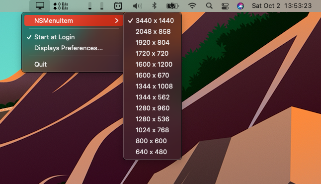

# Res Control

This is a simple MacOS menu bar app to allow the user to easily and quickly change (display modes / resolutions) of their connected displays and also supports HiDPI (retina) mode. This tends to come in very handy when one is presenting/sharing their screen and their audience's resolution is much smaller. 

> Great when one wishes to be a conscientious presentor during a code pairing session and said presentor is using a Ultra Wide or 4k resolution and their audience is not. 

## Screenshots
 
When a single monitor is connected. 

When multiple monitors connected. 

Available supported resolutions for particular monitor. 

## Installation

Grap the ZIP from the [release section](https://github.com/moros/Res-Control/releases), extract it, move it to your applications folder and open it. The app is notarized and signed with my Apple Developer ID and will execute/run without Gatekeeper getting in the way.